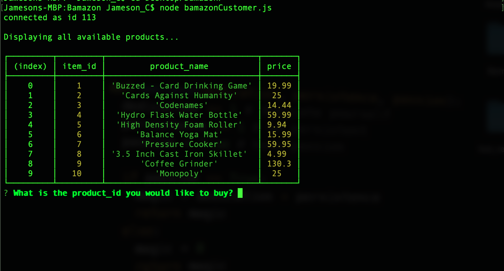
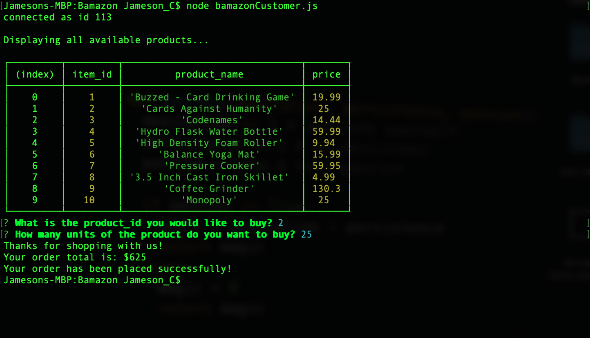

# Bamazon - a CLI app for an online store.

## How to Install: 

- Clone Repo to Desktop
- Install MySQL & Inquirer NPM Packages

## How to use bamazonCustomer: 

1) The app first displays all items available for sale. It will then prompt two questions asking a user for the ID of the product they wish to buy and number of units.

2) Once the order is placed, the app checks the MySQL DB if the store has enough product in stock to meet your request. If not, the app displays an insufficient quantity message and prevents the order from completing.

3) If the amount of units you wish to purchase is in-stock, a success message returns with the total amount of your order.

